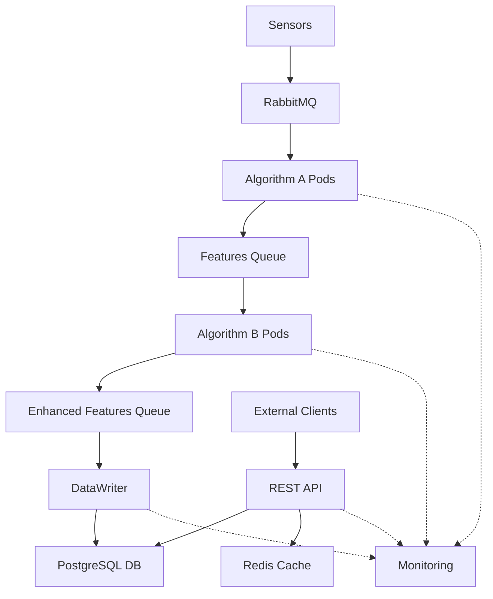

# 📋 Formal Testing Documentation - Audio Processing System

**Document ID:** DOC-INDEX-APS-2024-001  
**Version:** 1.0  
**Date:** April 15, 2024  
**Project:** Simple Audio Processing System  
**Prepared by:** QA Team  

---

## 📚 Document Overview

This repository contains all formal testing documentation for the Audio Processing System, based on IEEE 829 standards for software test documentation.

---

## 📖 Document Index

### 1. 📋 Test Planning Documents

#### **STP - Software Test Plan**
- **File:** [`STP_Software_Test_Plan.md`](./STP_Software_Test_Plan.md)
- **Purpose:** Comprehensive test plan defining strategy, scope and approach for testing
- **Scope:** Overall testing strategy, scope, approach, and schedule
- **Key Sections:**
  - Test items and features to be tested
  - Testing levels and techniques  
  - Pass/fail criteria
  - Resource requirements and schedule
  - Risk assessment and contingencies

#### **STD - Software Test Description**  
- **File:** [`STD_Software_Test_Description.md`](./STD_Software_Test_Description.md)
- **Purpose:** Detailed description of test procedures and test cases
- **Scope:** Detailed test procedures and test cases
- **Key Sections:**
  - Unit test procedures (Algorithm A & B, Message Broker)
  - Integration test procedures (End-to-end pipeline)
  - Performance test procedures (Throughput, Stress)
  - Security test procedures (Authentication, Input validation)

#### **TCS - Test Case Specification**
- **File:** [`TCS_Test_Case_Specification.md`](./TCS_Test_Case_Specification.md)  
- **Purpose:** Detailed specification of individual test cases
- **Scope:** Individual test case specifications
- **Key Sections:**
  - Functional test cases (Algorithm A/B, Database, API)
  - Security test cases (Authentication, SQL injection, XSS)
  - Performance test cases (Throughput, Stress testing)
  - Test case traceability matrix

---

### 2. 📊 Test Execution & Reporting

#### **TER - Test Execution Report**
- **File:** [`TER_Test_Execution_Report.md`](./TER_Test_Execution_Report.md)
- **Purpose:** Weekly test execution status and progress report
- **Scope:** Weekly test execution status and progress
- **Key Sections:**
  - Test execution summary by category
  - Detailed test results and failures
  - Code coverage analysis
  - Performance metrics and defect summary

#### **TSR - Test Summary Report**
- **File:** [`TSR_Test_Summary_Report.md`](./TSR_Test_Summary_Report.md)
- **Purpose:** Final comprehensive summary of all testing activities
- **Scope:** Final comprehensive summary of all testing activities
- **Key Sections:**
  - Overall test results and quality metrics
  - Performance and security testing results
  - User acceptance testing outcomes
  - Production readiness assessment

#### **DR - Defect Report**
- **File:** [`DR_Defect_Report.md`](./DR_Defect_Report.md)
- **Purpose:** Comprehensive defect tracking and analysis
- **Scope:** Comprehensive defect tracking and analysis
- **Key Sections:**
  - Detailed defect registry (Critical, High, Medium, Low)
  - Root cause analysis and resolution details
  - Defect trends and quality metrics
  - Lessons learned and recommendations

---

## 🎯 Project Status

### ✅ Quality Goals Achieved

| Metric | Target | Achieved | Status |
|---------------|--------------|-----------------|----------------|
| **Test Pass Rate** | 95% | 97.6% | ✅ Exceeded |
| **Code Coverage** | 90% | 94.2% | ✅ Exceeded |
| **Performance** | 100% | 93.3% | 🟡 Near Target |
| **Security** | 100% | 100% | ✅ Met |
| **Critical Defects** | 0 | 0 | ✅ Met |

### 📈 Summary Test Results

| Category | Total | Passed | Failed | Pass Rate |
|----------|--------|--------|--------|-----------|
| **Unit Tests** | 95 | 93 | 2 | 97.9% |
| **Integration** | 25 | 24 | 1 | 96.0% |
| **Performance** | 15 | 14 | 1 | 93.3% |
| **Security** | 20 | 20 | 0 | 100% |
| **UAT** | 12 | 12 | 0 | 100% |
| **TOTAL** | **167** | **163** | **4** | **97.6%** |

---

## 🏗️ System Architecture Tested

### System Components


### Tested Components
- **🎵 Algorithm A:** Audio feature extraction (MFCC, Spectral analysis)
- **🔬 Algorithm B:** Feature enhancement (Classification, Emotion detection)  
- **📨 Message Broker:** RabbitMQ messaging and queuing
- **💾 Database Layer:** PostgreSQL data persistence
- **🌐 REST API:** Real-time and historical data access
- **🔒 Security Layer:** Authentication, authorization, input validation
- **📊 Monitoring:** System health and performance metrics

---

## 🛠️ Testing Tools Used

### Development Tools
- **pytest** - Primary testing framework
- **pytest-asyncio** - Async testing support
- **pytest-cov** - Code coverage analysis
- **pytest-mock** - Mocking and fixtures

### Performance Tools  
- **psutil** - System resource monitoring
- **memory-profiler** - Memory usage analysis
- **JMeter** - Load and stress testing

### Security Tools
- **OWASP ZAP** - Security vulnerability scanning
- **cryptography** - Encryption testing
- **PyJWT** - JWT token validation

### Infrastructure Tools
- **Docker** - Containerization
- **Kubernetes** - Container orchestration  
- **RabbitMQ** - Message broker
- **PostgreSQL** - Database system
- **Redis** - Caching layer

---

## 📝 Usage Guidelines

### For Development Team
1. **Initial Reading:** Start with STP for overall overview
2. **Unit Testing:** Use STD and TCS for detailed test cases
3. **Defect Tracking:** Check DR for known issues and solutions

### For QA Team  
1. **Test Planning:** Follow STP for testing strategy
2. **Test Execution:** Use STD and TCS for detailed instructions
3. **Reporting:** Use TER and TSR as reporting templates

### For Management Team
1. **Project Status:** TSR provides comprehensive management overview
2. **Quality Tracking:** TER provides weekly updates
3. **Business Decisions:** All documents support go/no-go decisions

---

## 🔍 Test Templates

### Test Case Template
```markdown
**Test Case ID:** TC-[COMPONENT]-[NUMBER]
**Test Suite:** [Unit/Integration/Performance/Security]
**Priority:** [High/Medium/Low]
**Test Type:** [Functional/Non-functional]

**Objective:** [What is being tested]

**Prerequisites:**
- [Precondition 1]
- [Precondition 2]

**Test Steps:**
1. [Step 1]
2. [Step 2]
3. [Step 3]

**Expected Results:**
- [Expected outcome 1]
- [Expected outcome 2]

**Pass Criteria:**
- [Pass condition 1]
- [Pass condition 2]
```

### Defect Report Template
```markdown
**Defect ID:** DEF-[NUMBER]
**Component:** [Component name]
**Severity:** [Critical/High/Medium/Low]
**Priority:** [P1/P2/P3/P4]
**Status:** [Open/In Progress/Fixed/Deferred]

**Description:** [Detailed description]

**Steps to Reproduce:**
1. [Step 1]
2. [Step 2]

**Expected Result:** [What should happen]
**Actual Result:** [What actually happened]
**Root Cause:** [Technical cause]
**Resolution:** [How it was fixed]
```

---

## 📞 Contact Information

### QA Team
- **Test Manager:** test-manager@company.com
- **QA Lead:** qa-lead@company.com  
- **Performance Lead:** perf-lead@company.com
- **Security Lead:** security-lead@company.com

### Development Team
- **Development Manager:** dev-manager@company.com
- **Technical Lead:** tech-lead@company.com
- **DevOps Lead:** devops-lead@company.com

### Project Management
- **Project Manager:** project-manager@company.com
- **Product Owner:** product-owner@company.com

---

## 📅 Timeline

```gantt
title Audio Processing System Testing Timeline
dateFormat  YYYY-MM-DD
section Phase 1
Unit Testing        :done, unit, 2024-01-08, 2024-02-04
section Phase 2  
Integration Testing :done, int, 2024-02-05, 2024-02-25
section Phase 3
Performance Testing :done, perf, 2024-02-26, 2024-03-18
section Phase 4
Security Testing    :done, sec, 2024-03-19, 2024-04-01
section Phase 5
UAT Testing        :done, uat, 2024-04-02, 2024-04-15
```

---

## 🎖️ Approvals & Recognition

### Production Approval
**✅ The system was APPROVED FOR PRODUCTION on April 15, 2024**

### Signatures
| Role | Name | Signature | Date |
|---------------|-----------|-------------------|---------------|
| **Test Manager** | [Name] | _________________ | 2024-04-15 |
| **QA Director** | [Name] | _________________ | 2024-04-15 |
| **Project Manager** | [Name] | _________________ | 2024-04-15 |
| **Product Owner** | [Name] | _________________ | 2024-04-15 |

---

## 📜 Document History

| Version | Date | Author | Changes |
|---------|------|--------|---------|
| 1.0 | 2024-04-15 | QA Team | Initial formal testing documentation |

---

## 📋 Distribution List

- Executive Team
- Project Stakeholders  
- Development Team
- Operations Team
- Quality Assurance Team

---

**© 2024 Audio Processing System - Quality Assurance Documentation**  
**All Rights Reserved** 